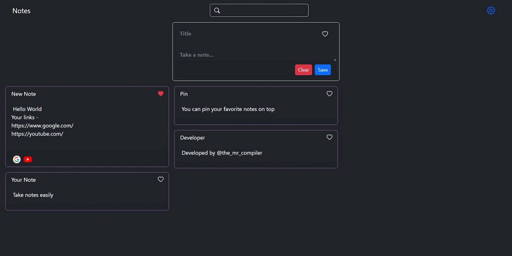
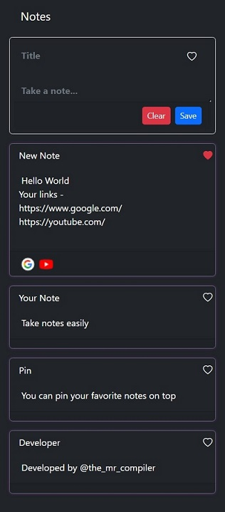

# Notes

Live@[Puhu-Notes](https://puhu-notes.web.app/)

## Welcome to our notes taking PWA app!

This app is developed using `Angular 14` and utilizes `local storage` to save your notes. With this app, you can easily take and organize notes on the go. All your notes are saved on your device, so you can access them even without an internet connection.

You can give your note a title and then add as much content as you want.

To organize your notes, you can use tags. Simply add a "#" followed by the tag you want to use in the body of your note, and the app will automatically create a tag for you.

We hope you enjoy using our notes taking app! If you have any questions or feedback, please don't hesitate to contact us. Happy note-taking!

